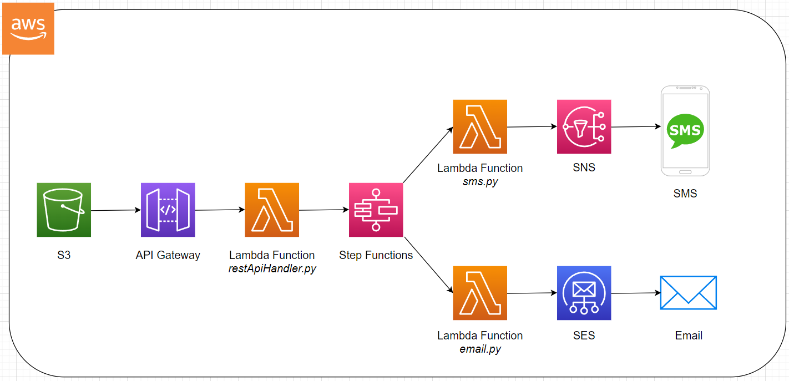

Here’s a detailed structure for your README to showcase your project:

---

# Notification Service Application

This project is an AWS-powered notification service that allows sending emails or SMS messages to users. It leverages **Lambda**, **SNS**, **SES**, **Step Functions**, and **API Gateway** for serverless functionality and scalability.

---

## Table of Contents
1. [Overview](#overview)
2. [Architecture](#architecture)
3. [Features](#features)
4. [Technologies Used](#technologies-used)
5. [Setup Instructions](#setup-instructions)
6. [Usage](#usage)
7. [Future Improvements](#future-improvements)


---

## Overview

This application provides a robust notification system that supports:
- **Email notifications** using Amazon Simple Email Service (SES).
- **SMS notifications** using Amazon Simple Notification Service (SNS).
- Workflow orchestration using **AWS Step Functions**.
- API endpoints exposed through **Amazon API Gateway**.

It is designed with a serverless architecture for high scalability and low operational overhead.

---

## Architecture

The system follows this flow:

1. **API Gateway**: Exposes RESTful endpoints for triggering notifications.
2. **AWS Lambda**: An api handler funtion and two other function that Processes incoming requests and handles business logic based on the request.
3. **Step Functions**: Orchestrates the process of sending notifications.
4. **SES**: Sends email notifications.
5. **SNS**: Sends SMS notifications.

  


---

## Features

- Send notifications via email or SMS.
- Robust and scalable serverless architecture.
- Workflow orchestration using Step Functions.
- Input validation and error handling.
- Modular and reusable components.

---

## Technologies Used

- **AWS Lambda**: For executing serverless functions.
- **Amazon SNS**: For SMS notifications.
- **Amazon SES**: For email notifications.
- **Step Functions**: For orchestrating workflows.
- **API Gateway**: For exposing API endpoints.
- **Terraform/CloudFormation** *(optional)*: For infrastructure as code (if used).

---

## Setup Instructions

1. **Clone the Repository**
   ```bash
   git clone https://github.com/Sherifsani/sendingApplication.git
   cd sendingApplication
   ```

2. **Configure AWS Credentials**
   Ensure your AWS credentials are set up locally. Use the AWS CLI or IAM role for access.
   check if aws is configured using:
   ```bash
   aws sts get-caller-identity
   ```
   if a json isn't returned then configure:
   ```bash
   aws configure
   ```

   

4. **Deploy the Infrastructure**
   Use the following command to deploy (replace with Terraform/CloudFormation instructions if applicable):
   ```bash
   terraform init
   terraform apply
   ```

5. **Update Environment Variables**
   Update Lambda environment variables such as:
   - `EMAIL_FROM` (SES verified email)
   - `REGION` (AWS region)
   - `TOPIC_ARN` (SNS topic ARN)

6. **Test the Application**
   Use tools like Postman or CURL to test API Gateway endpoints.

---

## Usage

1. **API Endpoints**
   - `POST /send-notification`
     - **Body Parameters:**
       ```json
       {
         "type": "email", // or "sms"
         "email": "user@example.com", // or phone number
         "message": "Your notification message.",
         "phoneNumber":"+234123456" //in this format
       }
       ```

2. **Example Response**
   ```json
   {
     "status": "success",
     "message": "Notification sent successfully."
   }
   ```

---


## Future Improvements

- Add support for push notifications.
- Integrate a front-end UI for easier usage.
- Implement detailed monitoring with CloudWatch and X-Ray.

---
